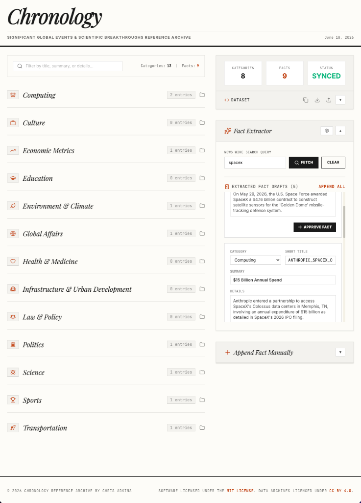
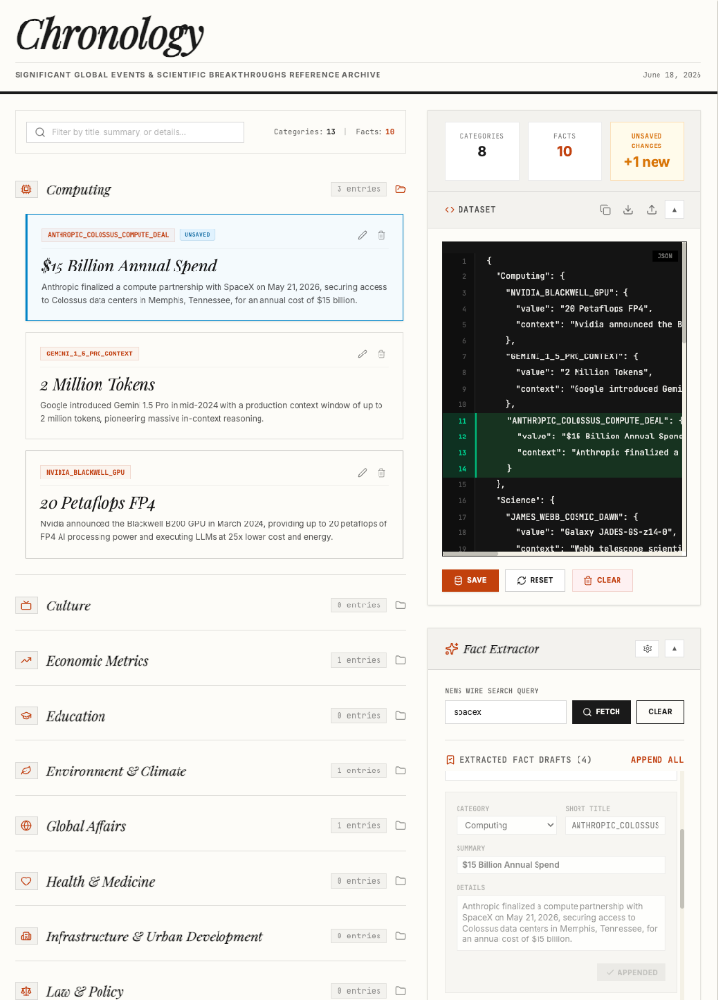

<p align="left">
  <a href="assets/screenshot.png"></a>
  <a href="assets/screenshot_updated.png"></a>
</p>

# Chronology

Chronology is a research curation dashboard designed to patch the structural knowledge gaps of open-source LLMs.
Because static language models are bound to their historical training cutoffs, they remain blind to recent events. Chronology bridges this gap by acting as a live programmatic patch—extracting, refining, and structuring verified global facts from 2024 through the present into an agent-ingestible, schema-strict JSON dataset.

```json
{
  "Sports": {
    "KNICKS_FIRST_TITLE_SINCE_1973": {
      "value": "NBA Championship Clinched (First since 1973)",
      "context": "The New York Knicks secured the NBA championship title, ending a 53-year drought since their previous victory in 1973."
    }
  }
}
```

## Key Features

* **13 Foundational Domains:** Tracks cross-industry metrics and breakthroughs in Computing, Culture, Economic Metrics, Education, Environment & Climate, Global Affairs, Health & Medicine, Infrastructure, Law & Policy, Politics, Science, Sports, and Transportation.
* **Local & Open Model Ready:** Native support for connecting to local models running via **LM Studio**, allowing you to patch outdated knowledge bases completely offline with private execution.
* **Dual Research Workflows:** Combines automated, LLM-powered extraction with manual, structured data overrides to maintain complete control over dataset quality.
* **Production-Ready Ingestion:** Formats verified, timestamped variables into a schema-strict JSON ledger built explicitly for retrieval-augmented generation (RAG) pipelines, context windows, or model fine-tuning.
* **Data Integrity Pipelines:** Integrates live visual state indicators, format verification checks, and inline JSON validation to prevent syntax breakage.

---

## Tech Stack

- **Frontend**: React 19, TypeScript, Tailwind CSS 4, Motion, Lucide Icons
- **Backend Service**: Express, tsx
- **Core AI Integration**: Google Gen AI SDK (`@google/genai`) with Gemini model grounding
- **Build System**: Vite & esbuild (compiling server-side entry points to optimized standalone CommonJS outputs)

---

## Get Started

### Prerequisites

- Node.js (v18 or upwards recommended)
- Standard npm client

### Installation

1. Clone or extract the repository files:
   ```bash
   git clone <repository-url>
   cd chronology
   ```

2. Install dependencies:
   ```bash
   npm install
   ```

3. Create your `.env` configuration at the root of the project. You must supply your private Google Gen AI API key. Optionally, you can add external research sources by signing up for free API keys:
   ```env
   # .env
   GEMINI_API_KEY=your-google-api-key-here

   # Optional news research keys:
   NEWS_API_KEY=your-newsapi-key-here
   NEWSDATA_API_KEY=your-newsdata-key-here
   NYT_API_KEY=your-nyt-api-key-here
   ```

### Obtaining Optional Research Keys
* **NewsAPI Key**: Register for a free developer account at [newsapi.org](https://newsapi.org).
* **NewsData.io Key**: Sign up for free at [newsdata.io](https://newsdata.io) to retrieve your key.
* **NYT API Key (New York Times)**:
  1. Visit the [New York Times Developer Portal](https://developer.nytimes.com).
  2. Create a free developer account and log in.
  3. Go to **My Apps** in the top navigation and click **+ New App**.
  4. Give your app a name (e.g., *Chronology Ingester*) and search for/enable the **Article Search API** product.
  5. Copy the generated **API Key** from your App dashboard and paste it as `NYT_API_KEY`.

---

## Configuring LM Studio for Local Execution

To run fact extraction completely offline and private on your own machine without using Google Gemini tokens, you can configure **LM Studio** as the backend:

1. **Download and Open LM Studio**: Install [LM Studio](https://lmstudio.ai/) on your machine.
2. **Download a Model**: Download a compatible model from the LM Studio homepage (e.g., Llama 3, Qwen 2.5, or Mistral).
3. **Configure & Start the Local Server**:
   - Go to the **Local Server** tab (the double arrow icon on the left panel in LM Studio).
   - Select the model you downloaded from the dropdown at the top.
   - In the settings panel on the right, under **Server Settings**:
     - **Enable CORS**: Toggle this setting to **ON** (CORS must be enabled so that your web browser running Chronology on `http://localhost:3000` is permitted to make requests to the local LM Studio server).
     - Check the **Port** (default is `1234`).
   - Click **Start Server**.
4. **Configure Chronology**:
   - Open the Chronology Dashboard in your browser.
   - In the right control sidebar under **AI Extraction Setup**, select the model **LM Studio (Local)**.
   - Enter your local server endpoint (default: `http://localhost:1234/v1`).
   - If you configured a token in LM Studio, enter it in the **LM Studio Token (Optional)** field.
   - The application will now route all extraction tasks to your local model, using 0 external API tokens.

---

### Development Mode

To boot the dev server locally using standard `tsx` executing `server.ts` directly:
```bash
npm run dev
```
The application will run on [http://localhost:3000](http://localhost:3000).

### Build & Production Deployment

To build both the frontend single-page application (SPA) static bundle and compile the custom backend server into a single optimized CJS bundle using `esbuild`:
```bash
npm run build
```

To run the production deployment server using NodeJS:
```bash
npm run start
```

---

## Database & State Handling

The application leverages a local file-based database for persistence.
- Modifying and adding data is managed dynamically in memory.
- All additions and modifications remain isolated within the local session's state until **Commit & Save** is selected.
- Selecting **Commit & Save** triggers sequential validation and writes the formatted JSON payload to `/data/seed.json`, updating the session to `STATUS: SYNCED`.
